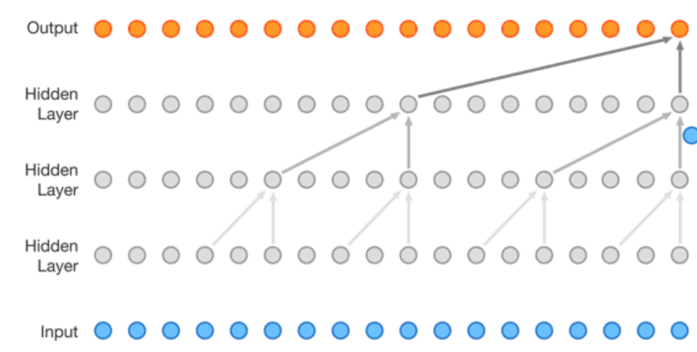

### 理解Transformer架构
参考：

[Illustrated Transformer](http://jalammar.github.io/illustrated-transformer/)

[How transformers work](https://towardsdatascience.com/transformers-141e32e69591)

[Attention Is All You Need](https://arxiv.org/abs/1706.03762)

从RNN到LSTM到attention机制的引入，encoder-decoder在逐步迭代优化，但是RNN-attention 仍然不能解决一些问题，比如并行处理输入的序列在这种框架下是不可行的，对于大量的语料翻译，这需要花费很长时间。为了解决这个问题，引入了CNN机制，一些处理sequence transduction问题非常流行的神经网络结构，比如Wavenet和Bytenet，都属于CNN。

CNN在处理输入的一串词的时候，不需要像RNN一样等待前面的词处理完，而是可以同时并行处理，但是CNN的并行处理并不能解决翻译时候的相互依赖问题，也就是少了attention机制，这就是Transformer被创造的原因，它是CNN网络和attention机制的结合。Transformer使用attention机制来提升翻译过程，并且它使用的是self-attention机制，其整体架构大致如下：

Transformer包含了6个编码器和6个解码器，每个编码器有相同的结构，包含两层：前向神经网络层和self-attention层，而每个解码器还除了包含这两层，还包含encoder-decoder attention 层。

#### 什么是Self-attention机制？

经过词嵌入后，输入encoder的是序列化的vector，比如一句话，每个字／词有自己的输入路径，self-attention 层便隐藏了这些路径之间的相互依赖关系，也就是这句话里字／词之间的相互依赖关系，而前向传播网络层不处理这些依赖关系，因此信息在流经神经网络层的时候可以执行并行运算。接下来，我们通过一个简单的例子来观察encoder的每一sub层发生了什么。

1. 第一步，通过encoder的输入vectors，构建3个vectors，分别是Query vector, Key vector, Value vector，这三个向量是通过3个矩阵生成的，而这3个矩阵是在训练过程中得到的，也就是模型训练的目标参数之一。需要注意的是，尽管这些新生成的vector维度通常是64（输入vector通常512），不是一定要这样的，这只是一种架构选择从而使得multiheaded attention 在大多数时候是constant（不明所以）。

 

2. 第二步，计算得分。在接下来的例子中，比如我们想计算第一个单词"Thinking"在self-attention机制下的得分，我们需要计算每个输入的单词跟"Thinking"的得分（也就是说包括"Thinking"自己跟自己的得分），这是一个dot product的过程，说白了就是两个向量之间的相似度。到这里我们就大致明白了第一步当中 Query vector, Key vector, Value vector这3个向量的作用是发挥在计算词之间相互依赖度的得分上。

 

3. 接下来是将得分除以8（实际上是key vector 的维度的平方根$\sqrt{d_k} = \sqrt{64}$，其目的是为了获得比较稳定的梯度，也可以有其他选择，这是default choice），然后经过softmax的操作得到归一化以后的得分。

 

4. 根据得分即权重将对应的value vector加起来，便是self-attention层处理后的输出，这个vector里就已经包含了输入序列之间的相互依赖关系了。

 

#### 什么是Multihead attention？
首先，我们把以上计算self-attention的过程用矩阵的方式表达：

从计算过程来看，multihead attention不只有一套QKV矩阵，而是有很多套不同的QKV并行接入：

这样从效果提升上相对于self-attention有以下两点：

1. 它能够使得模型有能力将注意力放在不同的位置信息上。这将有助于指代消解，比如在翻译"The animal didn't cross the street because it was too tired"，我们希望知道 it 到底指代的是什么。（其实不太清楚这点multihead attention是怎么做到的）

2. 它给了attention 层很多"representation subspaces"。正如计算过程中看到的，multihead attention 使用不只一套QKV矩阵，在Transformer的架构下使用了8个attention heads。每一组都通过随机初始化然后训练获得，每一组QKV能使得输入序列投射到不同的representation子空间。本质上，Transformer就是把self-attention的计算过程使用不同的权重矩阵重复8次，最后得到8个不同的Z矩阵（见上图）。

这会导致一个问题，因为前向网络层的输入其实是一个矩阵（a vector for each word），所以我们需要把这8个矩阵合并成一个矩阵：

权重矩阵 $W^0$ 是通过模型训练获得的。现在回到指代消解的那个例子，通过可视化来看一看multihead attention 在编码的时候到底有哪些不同的attention：

从上图我们便可发现，在multihead attention机制下，it这个单词的编码在不同的空间中跟句子里其他词之间的依赖关系是不同的，animal和tired这两个单词通过不同的子空间都跟it关联上了。这就是"multi-self-attention" 的强大之处。

以上，我们还遗漏了transformer模型里很重要的一点，对输入序列的位置信息编码：

这些positional encoding vector 能够帮助模型知道每个单词的位置信息，或者是不同单词之间的距离。

所以一个完整的Transformer encoder architecture 如下图所示：

搞定了编码器的基本原理，现在开始理解解码器的基本原理。encoder 的输出会变形为一组attention vectors K and V，输入到decoder的 "encoder-decoder attention"层，解码过程如下：

解码过程会一直重复，直到出现特殊符号代表输出结束。每一步的解码输出会作为下一步的解码输入。需要注意的是，解码器中的self-attention layer层跟编码器的作用方式有些不同。在解码器中，self-attention 层只被作用中已经输出的序列中，对于未来才会出现的position都被记为-inf。 "encoder-decoder attention"层的工作方式跟multihead attention是大致一样的，除了它的Q来自下面层的输出，K，V取自encoder stack 的输出。现在还剩一个问题，解码器的输出是一串浮点数，我们怎么将这些数转换成对应的词？因此在解码器完成后，还有最后的Linear层以及Softmax层。

Linear层就是一层简单的全联接神经网络层，其长度是等于训练集中不同词的总数，它连接Softmax层，长度同Linear层一致，输出每个词出现的概率。

以下，就是 transformer 架构的图示：

