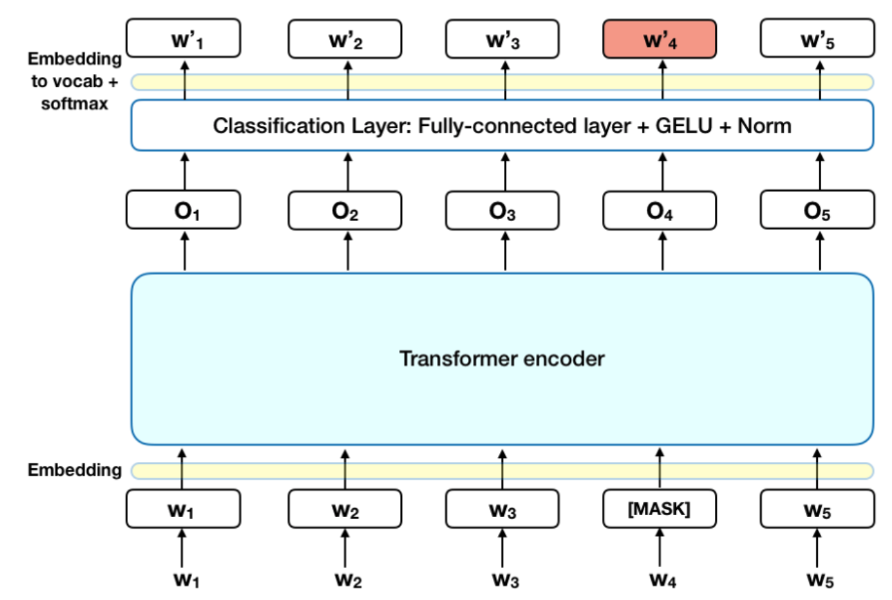
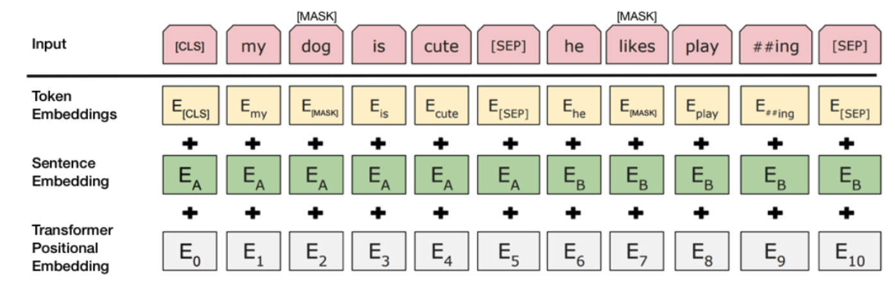

### Understanding BERT

[Bert Explained: State of the art language model for NLP](https://towardsdatascience.com/bert-explained-state-of-the-art-language-model-for-nlp-f8b21a9b6270)

(译文)

BERT(Bidirectional Encoder Representation from Transformers) 技术的革新在于它实现了语言模型Transformer 的双向训练，由Google AI的研究人员提出 [BERT: Pre-training of Deep Bidirectional Transformers for
Language Understanding](https://arxiv.org/pdf/1810.04805.pdf)。文中指出能够双向训练的语言模型会比传统的单向训练（从左到右或者从右到左）模型获得对文本更深入的理解。而使得双向训练称为可能的是一种叫MLM（Masked LM）的新技术。

#### 背景
在机器视觉领域，研究人员已经重复过迁移学习的可能性——先为解决一个问题而预训练出神经网络结构，当要解决另外一个新的问题时，不必从头开始训练，而是在之前已经训练好的神经网络基础上对参数进行细微调整，完成新模型的搭建。只不过最近，人们发现相同的技术也能使用在NLP上。

#### BERT怎么工作

BERT使用了Transformer里面的encoder机制。不同于那些directional model，Transformer的encoder会同时读入整个句子的信息，而不必从左到右或者从右到左序列化读入句子信息。因此，它具有双向性，或者更准确地说，它不具有方向性（non-directional），这个特征会使得模型能够处理每个单词完整的上下文信息。

在训练模型的时候，如何定义预测目标是不太容易的。很多模型直接定义预测句子的下一个词，比如"The child came home from ____"，有向模型自身的结构限制了模型对于context的学习。
而BERT使用两种策略来克服这个问题：MLM和NSP。

##### MLM (Masked Language Model)
在喂语料给BERT之前，每个序列里15%的单词被标记为[MASK] token。模型需要根据没有带MASK的其他词预测出MASK下的词是什么，如下图示：

这里损失函数里只考虑预测MASK下的词是否正确，而不包括那些没有带MASK的词的预测结果。在实际操作过程中，MASK的标注不完全是15%，而是有更加精细的控制。
##### NSP (Next Sentence Prediction)
在BERT的另外一种训练方式中，模型每次接收一对句子作为输入，然后预测第二句话是否是原语料中紧跟第一句话的。在训练过程中，50%的输入中第二句的确是紧跟第一句的，还有50%的输入第二句是随机从语料中抽取的。假设的前提是随机抽取的句子不能跟第一句平滑的连接起来。对输入部分有如下操作：
1. [CLS] token 被插入在句首代表第一句话开始，[SEP] token被插入在每个句子结束的位置。
2. 加入positional embedding （见Transformer的操作）
以下见图示：

通常MLM和NSP会组合成损失函数，BERT训练的目的是要使这个联合损失函数最小。

#### HOW TO BERT？
BERT在语言处理任务中有非常广泛的应用，只需要在原有的模型上添加一层：
1. 

Q. Bert的输入是embedded vector，这个vector是什么？