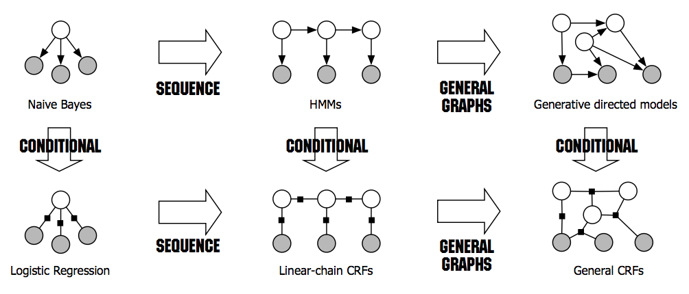

## An introduction to CRF

参考：[An Introduction to Conditional Random Field](https://arxiv.org/abs/1011.4088)

[Scofield 知乎高赞回答](https://www.zhihu.com/question/35866596/answer/236886066)

(译)
CRF主要应用于词性标注问题（part-of-speech tagging/pos tagging）目标是用adj, noun, adv, verb, perp 等标签对句子进行标注。