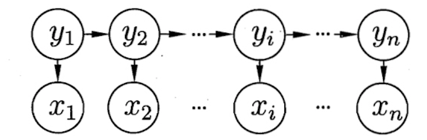
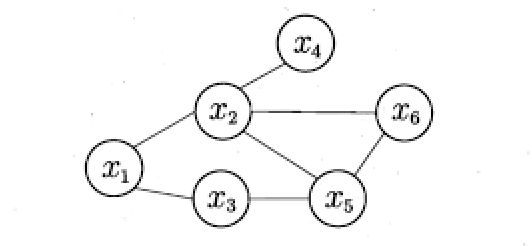
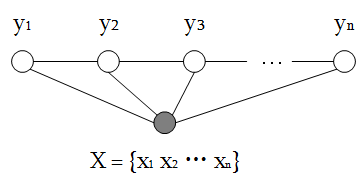
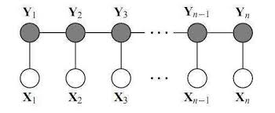

## An introduction to CRF

参考：[An Introduction to Conditional Random Field](https://arxiv.org/abs/1011.4088)

[Scofield 知乎高赞回答](https://www.zhihu.com/question/35866596/answer/236886066)

入了nlp的坑，深水区差点被呛死，现在都是高大上的各种端到端的算法，虽然仔细一看BERT也是2018年才问世，不过各种attention机制，transformer以及bert已经成为几乎每个nlp工程师的必备技能了。个人觉得，在直接学习这些fancy的算法之前，有必要把通往这个空中楼阁的路也踏踏实实走一遍，crf就是怎么都绕不过去的坎。

CRF全称条件随机场，第一次听闻这个名词，是2018年年初的时候，刚刚入行机器学习，西瓜书无意中翻到后面讲概率图模型，简直不知所云。所幸后来的工作并没有CRF的用武之地，也就不了了之。直到一个月前，开始接触nlp里面的模型算法，才发现CRF的用武之地在这里。然而哪怕看着知乎高赞回答，作者说他灵光乍现一身通透，我还是一脸懵逼，不晓得他看明白了啥。

直到今天早上，当我联想对比了统计物理里的Ising model，以及如何描述复杂的网络关系，我突然也顿悟了，横扫了西瓜书里CRF章节的内容，我终于明白作者到底在说个啥。

首先，在通往CRF的路上，有必要先要了解概率图模型，HMM模型，以及区分好判别式模型跟生成式模型。在前序知识没有很好的理解之前，理解后面出场的CRF显然是困难的。这就好像看本书，前面跳过了太多的铺垫和章节，直接看结局不仅没什么感觉，也会不明所以。

1.0 generative vs discriminative model

机器学习的任务是对于观测到的X如何建立模型输出预测Y。判别式于生成式建模最大的区别在于，判别式直接对$P(Y|X)$ 条件概率分布建模，直观理解就是给样本划定边界，这条边界可以由各种各样的函数去进行拟合，比如NN，SVM，DT，LR等都是属于这类建模。而生成式是对$P(X,Y)$ 联合分布建模，它得到的是“上帝信息”，即我们不仅关心知其然，还关心所以然，拿到上帝视角的信息后，再通过计算得到$$P(Y|X) = \frac{P(X,Y)}{P(X)}$$ 但是这已经不是建模过程需要关心的了，比如NB，LDA，CRF等都是属于生成模型。

2.0 概率图模型

一开始我并没想清楚，为什么要引入概率图模型，后来我发现是因为非自然语言处理的大部分机器学习问题不需要使用概率图模型，因为特征工程会尽量保证输入的一串变量之间几乎是相互独立的，并且对于分类或者回归问题，输出部分Y之间没有时序或者关系上的某种关联。所以说是自然语言处理面对的问题的复杂度倒逼了更复杂的高级模型，也就是概率图模型。而且仔细想想，用图来表示变量之间的相互关系真的是一件再自然不过的事情。一个模型越是复杂，体现在模型中变量之间复杂的依赖关系。这是为什么人类社会是一个极度复杂的系统的根本原因，每个个体具有不可观测性，因而每个个体具有千万种选择，这又导致个体与个体之间的关联原因和方式千差万别，这才是人生最有趣的地方。

概率图模型大致分为两类：有向无环图，有向代表了变量之间的因果关系，称为有向图模型或者贝叶斯网；无向图，代表变量之间不存在因果关系，只是位置关系，类似于固体物理里面晶格点阵，相邻格点之间有相互作用关系，次次近邻格点之间不考虑相互作用关系，这类称为无向图模型或马尔可夫网。

3.0 HMM模型

HMM是一种有向图模型，且属于生成模型，由一组序列相关的隐状态$(y_1,y_2,...y_n)$和相应的观测状态构成：

根据箭头代表的变量之间的依赖关系，写出代表这个图的唯一代数表达式：
$$P(x_1,y_1,...,x_n,y_n) = P(y_1)P(x_1|y_1)\prod_{i=2}^nP(y_i|y_{i-1})P(x_i|y_i)$$
因此，求解该结构下的概率分布需要知道$P(y_i|y_{i-1})$以及$P(x_i|y_i)$，前者代表了状态转移概率，由矩阵A表示，后者就是观测概率分布，由矩阵B表示，加上初始状态的选择$\pi$，一个隐马尔可夫模型便可以由参数$\lambda =[A,B,\pi]$来决定。

在实际应用过程中，常常有以下三类问题可以用HMM解决：

* 训练好参数$\lambda =[A,B,\pi]$后，求解某一观测序列出现的概率$P(O|\lambda)$。比如对词性标注好的语料进行训练得到模型参数后，求解某句话出现的概率，在实际应用场景中可以是拼写纠错，或者在语音识别领域可作为语言模型对识别结果进行纠错，提高识别准确率。针对这类问题，使用的方法是向前或向后传播算法，其思想是逐步计算，每完成一步计算，存储当前结果，避免路径的重复计算，降低计算量。

* 给定$\lambda =[A,B,\pi]$，已知某一观测序列$(x_1,x_2,...x_n)$，求解生成这一观测序列的最大概率状态路径$(y_1,y_2,...y_n)$，比如给定一句话，输出词性标注序列。解决这类问题的思路是动态规划，在每一个当前步，计算从上一步到现在这一步最大概率的路径，由此可以保证最终点概率最大的路径就是全局最优解。假设有k种不同的隐状态，那么在状态空间会生成 $ k (n-1) $ 条连线，对应k条不同路径，而最大概率路径必在其中之一。假设有任何一条连线不在这些生成的连线中，那么必然可以找到概率更大的那条连线来保证这个解不是最优解。以上就是维特比算法的基本思想。

* 第三种应用是给定观测序列$(x_1,x_2,...x_n)$，求模型参数$\lambda =[A,B,\pi]$ 使得$P(x|\lambda)$ 的概率最大。比如当我们有了词性标注好的预料，如何建立模型求得$\lambda$ ？也就是训练过程到底是怎么进行的？如果隐状态$(y_1,y_2,...y_n)$是已知的，那么可以通过统计的方式直接求取$\lambda$，例如这里提到的词性已经标注好了，那么我们统计每个词性出现后下一个与之相邻的词性出现的概率就是转移矩阵A所包含的内容，而每个词性对应的词在语料中出现的概率分布就是B想表达的东西。但如果隐状态是未知的，比如我们拿到的是海量没有被标注的预料，这比较接近现实中遇到的问题，用户会积累大量的语料数据，然而标注却是极度耗费时间和人工成本的，让模型自动学习去获取隐状态的参数肯定是我们喜闻乐见的一件事，这个时候EM算法便大显身手了。

EM算法的基本是思想是，设定目标函数的下界函数Q函数，通过不断迭代寻找Q函数的最大值来逼近目标似然函数的最大值，因此EM算法对初值很敏感，而且并不能保证寻找到全局最优解。

4.0 马尔可夫随机场

马尔可夫随机场是典型的马尔可夫网，也就是无向图模型:

无向图里结点之间的连线没有箭头，不存在因果依赖关系，而是一种类似物理当中粒子之间的相互作用关系，所以只包含“位置”信息，而没有“时间”信息。因此，在描述一个无向图所代表的联合概率分布时引入“团”的概念，简单来说一个“团”里的结点总是两两互联，比如上图当中$\{x_2,x_5,x_6\}$就是一个团，而$\{x_1,x_2,x_4\}$就不是一个团。团概念的引入能够保证分解唯一，也就保证了图和代数表达式一一映射的关系。因此联合概率被定义为$$P(X) = \frac{1}{Z}\prod_{Q \in C} \psi_Q (X_Q)$$ 即我们将所有子团的连乘表达形式作为一个无向图代表的一组有相互关联的变量之间的联合概率分布。Z也叫配分函数，类似于统计物理当中的配分函数，是对于所有可能的$X$求和$$Z = \sum_X \prod_{Q \in C}\psi_Q(X_Q)$$，也就是说一个图对应一种建模方式，对于不同的X取值，图也对应了不同的值。就像二维的晶格，粒子处于不同的状态，系统就有不同的能量，把体系处于不同能量的概率加起来，就是我们的配分函数。想到这里的时候，觉得很奇妙，因为在处理“相互作用”的时候，底层使用的是同一套数学工具方法。

其实一开始我理解错了，我以为这个求和是对不同的图的求和。比如对于上面的无向图，X变量之间除了可能是这样的连接关系，还有可能是另外一种连接关系（比如$x_2$同$x_5$之间并没有关联），把所有可能的图加起来，就是配分函数的意思。这种想法的问题在于，每一个时刻，系统只是可能处于一种态上（机器学习问题都是宏观统计层面，不讨论量子力学里的叠加态哈），所以在建模的时候只考虑一种最有可能的图结构。其实，对于一个够复杂的系统，比如人类社会，变量之间的关系的确是随着时间的推移而发生变化的，也就说图结构是随着时间发生变化的，这个时候我们想做一个时间尺度上的期望计算，比如预测市场，那就不仅是各图遍历，还要把每个图的各态遍历。跑题了。。。

为了去除冗余，使表达方式更加精简，常常会极大团的连乘形式来代替所有子团的连乘表达。比如上图中$\{x_2,x_5,x_6\}$构成一个极大团，包含$\{x_2,x_5\},\{x_2,x_6\},\{x_5,x_6\}$
这三个小团，那么上图就可以写做：$$P(X) = \frac{1}{Z} \psi(x_2,x_5,x_6)\psi(x_3,x_5)\psi(x_1,x_2)\psi(x_2,x_4)\psi(x_1,x_3)$$
更一般地有：$$P(X) = \frac{1}{Z}\prod_{Q\in C^{\star}}\psi_Q(X_Q)$$

现在，我们就可以开始具体讨论在无向图模型下，结点之间的独立性条件是怎么成立的，由此引入“分离”的概念，如果点集A和B被点集C分离，则称C为“分离集”，对于马尔可夫随机场，具备以下两个性质：

* 全局马尔可夫性：给定两个变量子集的分离集，这两个子集条件独立$$P(x_A,x_B|x_C) = P(x_A|x_C)P(x_B|x_C)$$
这个很好理解，没有直接相连的两个子集之间自然不存在相关关系，彼此就是独立的。

* 局部马尔可夫性以及成对马尔可夫性：不直接相连的变量之间就是相互独立的。

5.0 CRF

等了这么久，终于可以开始理解条件随机场了。CRF是一种判别式无向图模型。所以，如果你不知道什么是判别式，什么是图概率模型，什么是有向无向，给你这个CRF的定义，看一百遍也不可能理解这个东西，顶多深深印在脑海里，过段时间还给忘了。这就引出了一个很简单很简单的道理，要理解一个复杂的东西，必须要有足够的铺垫，要完成一件复杂的事情，必须要有足够的耐心。很多时候我们不理解，因此焦虑，说白了还是不够耐心，总要一步到位解决既要，又要，还要，且要的问题。

进入正题。CRF试图对多个变量在给定观测值后的条件概率进行建模。例如，给定观测序列$(x_1,x_2,...x_n)$，$(y_1,y_2,...y_n)$是与之相应的标记序列，CRF的目标是对$P(Y|X)$进行建模，和以前遇到的机器学习问题，比如用逻辑回归解决西瓜分类问题，两者最大的区别在于前者的Y具有某种结构，即其个分量之间具有某种相关性。比如在词性标注问题中标注词之间有序列关系，语义分析中标记是一颗语法树，具有树的结构关系，而后者的Y不具有结构，输出值之间相互独立。因此从理论上讲，CRF的图取决于Y，可以具有任意结构，不过在现实应用中，最常见的是“链式条件随机场”，图结构如下：

此图表明，Y之间是链式相关结构，与HMM生成式模型不同，HMM中的Y之间存在序列因果关系，虽然单纯从结果来看，两种模型都能给出相同的解，但是对于这组解后背的机制，因果相关孰优孰劣，却几乎是哲学上的问题。上图还表明了一个假设，就是X之间是相互独立的。

现在，我们来考虑条件概率的定义方式。“CRF使用势函数和马尔可夫图模型中的极大团概念来定义目标条件概率”，西瓜书原话，看不懂很正常，太精简了。先看马尔可夫场中的势函数是怎么定义的：$$\psi_Q(X_Q) = e^{-H_Q(X_Q)}$$
$$H_Q(X_Q) = \sum_{u,v \in Q, u\neq v} \alpha_{u,v}x_u x_v + \sum _{v\in Q} \beta_v x_v$$
当我看到这个表达式的时候，我觉得非常眼熟。想想Ising model里哈密顿量怎么写的，相邻粒子之间的自旋相互作用求和，以及外场施加下每个粒子所感受到的势能，顶多再考虑次近邻粒子之间的相互作用，再想想其能量分布，把哈密顿量放到e指数上去，然后你发现这两者在数学上处理的思路一模一样！也就是说，以前写Ising model的时候，只关心其能量的表达形式，也就是物理含义，未曾想过，从图概率模型的角度描述Ising model也能得到一模一样的表达！后来我发现概率图模型的奠基人是物理学硕士。

理解了马尔可夫场里势函数的定义，再去看crf定义的条件概率：$$P(Y|X) = \frac{1}{Z}exp(\sum_j\sum_{i=1}^{n-1}\lambda_jt_j(y_{i+1},y_i,X,i) + \sum_k\sum_{i=1}^n\mu_ks_k(yi,X,i))$$
实际上可以进一步写成：$$P(Y|X) = \frac{1}{Z}exp(\sum_j\sum_{i=1}^{n-1}\lambda_jt_j(y_{i+1},y_i,x_i)+ \sum_k\sum_{i=1}^n\mu_ks_k(y_i,x_i))$$
对应的图有如下结构：

我们就会发现两者都是通过团上的势函数定义概率，形式上没什么显著区别。只不过如果按照之前的理解，我会顺势写出如下CRF条件概率表达式：
$$P(Y|X) = \frac{1}{Z}exp(\sum_{i=1}^{n-1}\lambda_it(y_{i+1},y_i,x_i) + \sum_{i=1}^n\mu_is(y_i,x_i))$$

这类似于HMM里的A概率转移矩阵以及B观测矩阵，比上面的表达更简单。但应用的情况是，CRF里引入了特征函数，这使得Y各分量之间的链式关系可以不相同，比如语义分析里面的树结构，以及动词后面接名词的概率在句子不同的位置其实也是不一样的；同时，从Y到X的观测也可以局部不相同。所以特征函数的引入是丰富了图结点之间的连接细节，这点HMM是做不到的。由于这个特征函数能够在局部给出判定界限，不同的局部给出的判定规则可以不相同，每个局部判定类似于逻辑回归给出分类界线，因此说CRF可以看作逻辑回归的扩展，是判别式模型。

现在我们可以回头看最开始的第一张图了，它给出了NB，LR, HMM,
CRF之间的联系，NB是生成式模型，序列扩展就是HMM，最简单的动态贝叶斯网，LR是一种判别式模型，序列扩展得到链式CRF，是同HMM网络结构相似的马尔可夫网。

