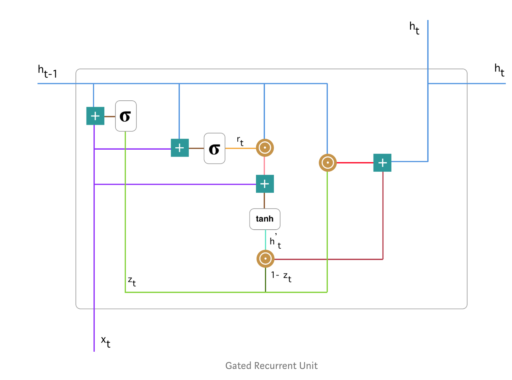

### LSTM and GRU

reference:
[colah.blog on lstm](https://colah.github.io/posts/2015-08-Understanding-LSTMs/)

[blog-exploring-lstm](http://blog.echen.me/2017/05/30/exploring-lstms/)
以上两篇博文对LSTM的结构有非常详尽的描述和图解，看明白以后结合keras就可以开始快速实验关于lstm的网络架构了。

关于GRU
参考：
[Understanding GRU Networks](https://towardsdatascience.com/understanding-gru-networks-2ef37df6c9be)

GRU (Gated Recurrent Unit) 于2014年由[Cho.et al.](https://arxiv.org/pdf/1406.1078v3.pdf)提出，目的是为了解决标准循环神经网络里的梯度消失问题。GRU也可以被视作LSTM的变体，在一些情况下，两者都能给出很好的结果。

GRU是怎么工作的呢？

1. Update gate
$$z_t = \sigma (W^{(z)}x_t + U^{(z)}h_{t-1})$$
此处激活函数为sigmoid，输出0，1结果。Update gate的目的是帮助模型决定有多少过去的信息会被送到未来。

2. Reset gate
$$r_t = \sigma (W^{(r)}x_t + U^{(r)}h_{t-1})$$
Reset gate用来决定对于过去的信息选择多少去遗忘。

3. Current memory content
$$h^c_t = tanh(Wx_t + r_t\odot Uh_{t-1})$$
对于过去的信息选择性提取一部分，并且整合当前的输入信息，给出当前cell的memory信息。

4. Final memory at current time step
$$h_t = z_t\odot h_{t-1} + (1-z_t)\odot h^c_t$$
对于当前cell的最终输出$h_t$，一部分来自$h_{t-1}$，另一部分由$h^c_t$贡献，$z_t$可以视作选择概率，两项系数求和刚好为1.

以上为GRU结构的全部信息。

问题：为什么RNN会有梯度消失的问题，以及为什么LSTM和GRU能够很好的解决这个问题？

不是RNN会有梯度消失的问题，而是所有的深度学习网络都有可能发生梯度消失的问题，而造成某一梯度接近为0的根本原因在于激活函数一阶导数存在很小的值。所以Relu就可以解决梯度消失的问题。在cnn图像处理问题当中就是这么干的。问题是为什么RNN倾向于选择tanh函数，这个才是造成深度RNN网络梯度消失的根本原因。LSTM要解决的就是在RNN+tanh激活函数的深度网络里梯度消失的问题，通过引入比较复杂的cell结构，在每个cell计算当前的梯度下降时把当前的梯度改成了求和形式，也就是说gate的设计可以避免梯度过度小，从而解决了梯度消失问题，当然，lstm的参数也是rnn的4倍。