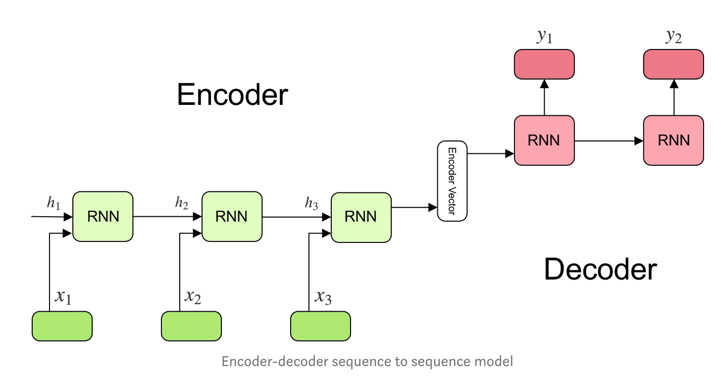

Understanding encoder-decoder Seq2seq model

reference:[understanding encoder-decoder seq2seq model](https://towardsdatascience.com/understanding-encoder-decoder-sequence-to-sequence-model-679e04af4346)

(译+理解)
在machine learning，QA的任务中，常常会用到seq2seq model，该模型是由Google于2014年提出，为了解决输入和输出有不同的size或者category的问题。比如，翻译"What are you doing today" 这句话，输入输出是完全不同的，我们不能逐词one_on_one的翻译，这就需要seq2seq来解决了。

首先上一张encoder-decoder的图：

Encoder 部分是a stack of recurrent unit (LSTM or GRU), 每个unit接收一个word或symbol的vector，比如在QA问题中每个$x_i$代表第i 个word，隐藏态的计算如下：
$$h_t = f(W^{(hh)}h_{t-1} + W^{(hx)}x_t)$$

Encoder Vector
由编码器最后一部的隐状态构成，包含了编码端所有输入元素信息，同时作为解码器的初始隐藏状态输入。

Decoder部分是一连串RNN单元组成，负责序列输出，比如QA问题里就是顺序回答的每个word，$h_t, y_t$计算如下：
$$h_t = f(W^{(hh)}h_{t-1})$$
$$y_t = softmax(W^S h_t)$$
以上，就是seq2seqmodel的基本要义和最简单的解读。

问题：softmax给出的是每个word的概率？那这个多分类岂不是很huge？比如英汉语常用3000词／字？