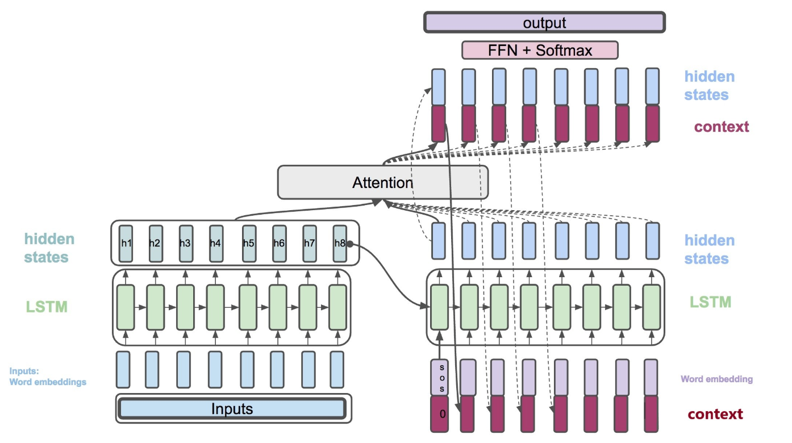
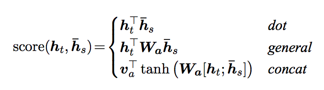
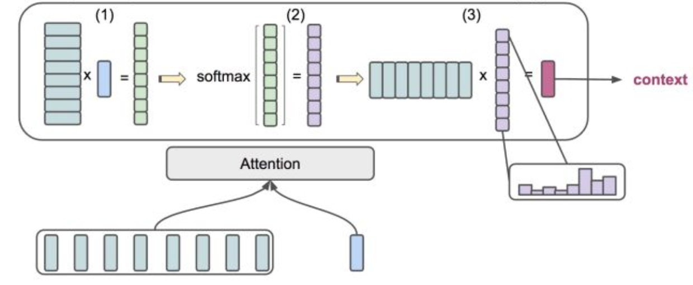
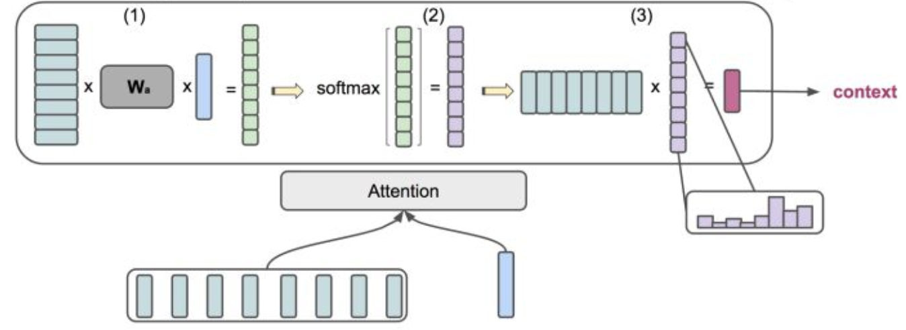

### seq2seq+attention understanding

参考：

[Neural Machine Translation by Jointly Learning to Align and Translate](https://arxiv.org/abs/1409.0473)

[Visualizing A Neural Machine Translation Model](https://jalammar.github.io/visualizing-neural-machine-translation-mechanics-of-seq2seq-models-with-attention/)

[真正的完全图解Seq2Seq Attention模型](https://zhuanlan.zhihu.com/p/40920384)

没有添加attention机制的RNN encoder-decoder框架里，编码器会把序列化的信息（比如一句话，一段语音）编码进入一个长度固定的vector里，记为c：
$$h_t = f(x_t,h_{t-1})$$
$$c = q(\{h_1,...h_{T_x}\})$$
训练目标是根据encoder-decoder输入的语言对输出该语言对的得分，翻译越准确得分越高，或者说对于精准匹配的 $(\mathbf{x}, \mathbf{y})$ 使得概率 $p(\mathbf{y}|\mathbf{x})$ 尽可能大：
$$p(\mathbf{y}) = \prod_{t=1}^{T}p(y_t|\{y_1,...y_{t-1}\},c)$$
$$p(y_t|\{y_1,...y_{t-1}\},c) = g(y_{t-1},s_t,c)$$
由以上表达式可知，解码的过程其实使用了输入端的全部编码信息，这种方案在句子非常长的时候，decoder的表现效果就会比较差。这其实也不太符合人在处理翻译问题上的机制，比如简单的一句"Hello, how are you?"，我们在翻译“你好”这个词的时候显然跟“hello”这个单词是直接强相关的，即便没有后面的句子，我们也能准确完成翻译任务。因此，作为seq2seq的改进版本，引入注意力机制就是一件很自然能想到的事情。我们希望decoder在解码的时候，能够自动在输入序列里获取对于当前翻译任务最相关的部分，而不是对于输入序列全部平权对待。这就是"learning to align and translate" 的过程。

在这个新的框架下，上面的式子被重新定义为：
$$p(y_i|y_1,...y_{i-1}, \mathbf{x}) = g(y_{i-1},s_i,c_i)$$
$$s_i = f(s_{i-1},y_{i-1},c_i)$$
不同于之前的定义，对于目标预测$y_i$，条件概率跟$c_i$相关，注意力机制由此引入。所以直觉上来看，$c_i$必然是跟输入序列相关的，定义为：
$$c_i = \sum_{j+1}^{T_x}\alpha_{ij}h_j$$
这里对于权重的考量，或者说在完成目标预测$y_i$时，把注意力放在哪些输入的词上，$\alpha_{ij}$ 的定义如下：
$$\alpha_{ij} = \frac{exp(e_{ij})}{\sum_{k=1}^{T_x}exp(e_{ik})}$$
$$e_{ij} = a(s_{i-1},h_j)$$
字母a代表alignment model，相当于一个打分机制，如果在这个打分规则下，decoder获得的隐藏层输出$s_{i-1}$跟第j个encoder输入得到的隐藏层输出$h_j$越是“接近”，那么得分越高，相应地，$h_j$的权重会更高，也就意味着机器会将更多的注意力放在$h_j$对应的单词上面。以下就彻底图解了seq2seq+attention机制：

那么具体的都有哪些打分机制呢？论文 [Effective Approaches to Attention-based Neural Machine Translation](https://arxiv.org/pdf/1508.04025.pdf) 当中提到了3中方式：

以下两张图分别给出dot和general的打分机制：

Q. encoder-decoder translation model 是怎么训练的？损失函数是怎么定义的？